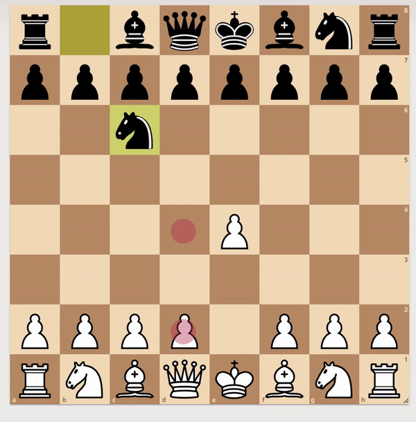

# ChessHelper

This should be used only for playing against computers.

### Supported browsers

1. Google Chrome

### Supported platforms

1. Windows

### Supported Websites

1. https://lichess.org/

### Install

Run ```python3 setup.py``` and follow instructions

### Use

1. Enable extension in browser
2. Run ```python start.py```
3. Go to one of supported websites and enjoy

### Demo


